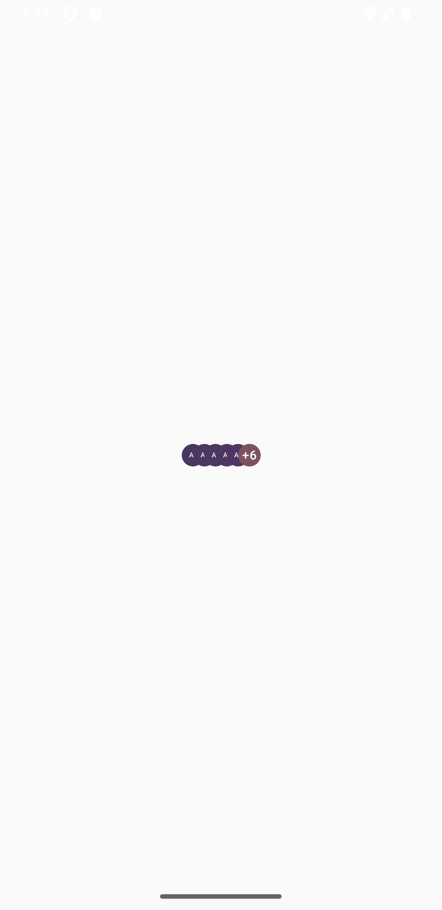
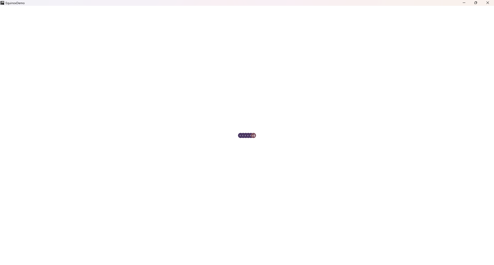

This component allows you to creatively display a list of avatar items. It is fully customizable, and the recommended
approach is to show either the user's profile picture or a placeholder using for example the [LetterAvatar](LetterAvatar.md) component

## Usage

```kotlin
class TestScreen : EquinoxNoModelScreen() {

    @Composable
    override fun ArrangeScreenContent() {
        Column(
            modifier = Modifier
                .fillMaxSize(),
            horizontalAlignment = Alignment.CenterHorizontally,
            verticalArrangement = Arrangement.Center
        ) {
            Avatars(
                avatars = List(11) { "Avatar $it" },
                visibleAvatars = 5, // number of visible avatar
                // mandatory to use for a correct behavior
                avatar = { modifier, size, shape, avatar ->
                    // your avatar content e.g
                    LetterAvatar(
                        modifier = modifier,
                        shape = shape,
                        name = avatar,
                        size = size
                    )
                }
            )
        }
    }

}
```

## Customization

Check out the table below to apply your customizations to the component:

| Param               | Description                                                                                             |
|---------------------|---------------------------------------------------------------------------------------------------------|
| `modifier`          | The modifier to apply to the component                                                                  |
| `showSingleAvatar`  | Whether when the `avatars` list has just one element the component is to display                        |
| `shape`             | The shape to apply to the `avatar` content and to the `RemainingAvatarsBadge`                           |
| `size`              | The size of the `avatar` content and to the `RemainingAvatarsBadge`                                     |
| `offset`            | The horizontal offset to apply to each item to move it horizontally                                     |
| `remainingBadge`    | The content used to display how many avatars remain after the `visibleAvatars` number has been exceeded |
| `supportingContent` | The supporting content to describe this component or to add extra elements to it                        |

### Custom remainingBadge

You can customize as you want the content used to display the remaining avatars number not displayed

#### Usage

```kotlin
Avatars(
    avatars = List(11) { "Avatar $it" },
    visibleAvatars = 5, // number of visible avatar
    // mandatory to use for a correct behavior
    avatar = { modifier, size, shape, avatar ->
        // your avatar content e.g
        LetterAvatar(
            modifier = modifier,
            shape = shape,
            name = avatar,
            size = size
        )
    },
    remainingBadge = { modifier, remainingAvatars ->
        // your content e.g.
        Button(
            modifier = modifier, // mandatory to apply for a correct behavior
            onClick = {
                // some action
            }
        ) {
            Text(
                text = remainingAvatars.toString()
            )
        }
    }
)
```

### Custom supportingContent

The component allows to use a custom supporting content to describe it or to add extra elements to it

#### Usage

```kotlin
Avatars(
    avatars = List(11) { "Avatar $it" },
    visibleAvatars = 5, // number of visible avatar
    // mandatory to use for a correct behavior
    avatar = { modifier, size, shape, avatar ->
        // your avatar content e.g
        LetterAvatar(
            modifier = modifier,
            shape = shape,
            name = avatar,
            size = size
        )
    },
    supportingContent = {
        Text(
            text = "Team"
        )
    }
)
```

## Appearance

#### Mobile

{ .shadow .mobile-appearance }

#### Desktop & Web

{ .shadow }