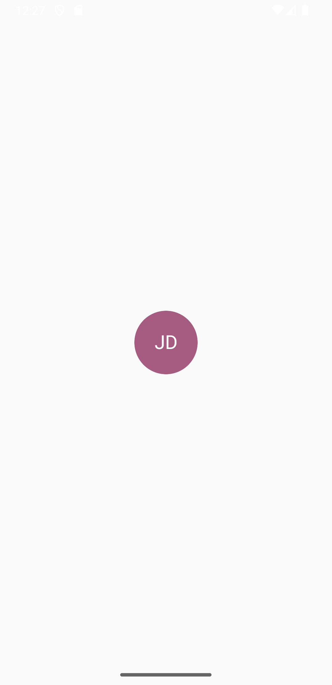
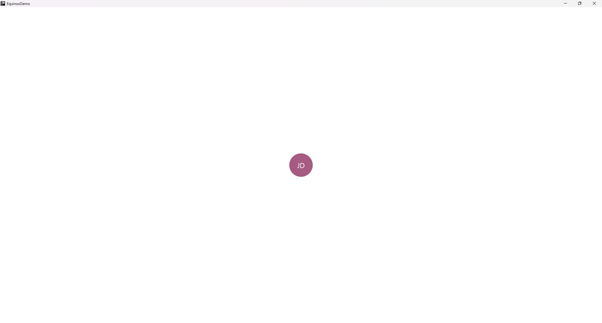

This component allows to display the letters of a provided name in the format: 

```text
Name Second-name Third-name -> (NST)
```

## Usage

```kotlin
class TestScreen : EquinoxNoModelScreen() {

    @Composable
    override fun ArrangeScreenContent() {
        Column(
            modifier = Modifier
                .fillMaxSize(),
            horizontalAlignment = Alignment.CenterHorizontally,
            verticalArrangement = Arrangement.Center
        ) {
            LetterAvatar(
                name = "John Doe",
                size = 75.dp, // custom size
            )
        }
    }

}
```

## Customization

Check out the table below to apply your customizations to the component:

| Param             | Description                                                                                                  |
|-------------------|--------------------------------------------------------------------------------------------------------------|
| `modifier`        | The modifier to apply to the component                                                                       |
| `shape`           | The shape to apply to the component                                                                          |
| `elevation`       | The elevation to apply to the component                                                                      |
| `uppercaseFormat` | Whether the letters must be displayed in uppercase format or displayed as provided                           |
| `name`            | The name of the avatar                                                                                       |
| `backgroundColor` | The color of the background, default color is resolved with [resolveAvatarColor](#resolveavatarcolor) method |
| `style`           | The style of the displayed letters                                                                           |

## Appearance

#### Mobile

{ .shadow .mobile-appearance }

#### Desktop & Web

{ .shadow }

## Public methods

### resolveAvatarColor

#### Description

Method used to resolve the background color for this component

#### Usage

```kotlin
val avatarColor: Color = resolveAvatarColor(
    name = "John Doe"
)

println(avatarColor.toHex()) // e.g #A55C80
```