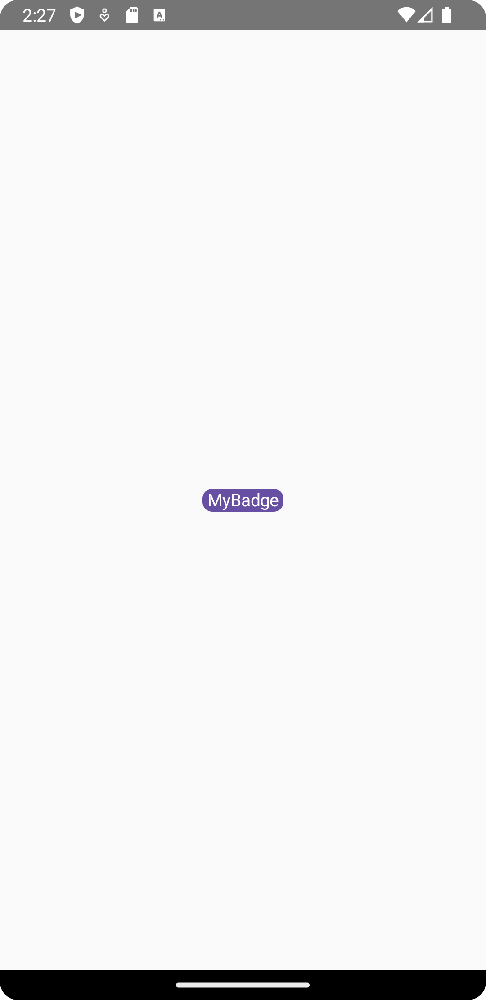

## Classic

This component allows to display a customizable badge in your UI.
It is useful for showing labels, states or tags in a visually distinct way

### Usage

```kotlin
class TestScreen : EquinoxScreen<EquinoxViewModel>() {

    @Composable
    override fun ArrangeScreenContent() {
        Column(
            modifier = Modifier
                .fillMaxSize(),
            horizontalAlignment = Alignment.CenterHorizontally,
            verticalArrangement = Arrangement.Center
        ) {
            BadgeText(
                badgeText = "MyBadge",
                badgeColor = MaterialTheme.colorScheme.primary
            )
        }
    }

}
```

### Customization

Check out the table below to apply your customizations to the component:

| Property         | Description                                                                                                                                                                                                                      |
|------------------|----------------------------------------------------------------------------------------------------------------------------------------------------------------------------------------------------------------------------------|
| `modifier`       | The `Modifier` to be applied to the component                                                                                                                                                                                    |
| `shape`          | The shape of the badge                                                                                                                                                                                                           |
| `padding`        | The padding applied from the text to outside the badge                                                                                                                                                                           |
| `elevation`      | The elevation to apply to the badge                                                                                                                                                                                              |
| `fontSize`       | The size of glyphs to use when painting the text. See `TextStyle.fontSize`                                                                                                                                                       |
| `fontStyle`      | The typeface variant to use when drawing the letters (e.g., italic). See `TextStyle.fontStyle`                                                                                                                                   |
| `fontWeight`     | The typeface thickness to use when painting the text (e.g., `FontWeight.Bold`)                                                                                                                                                   |
| `fontFamily`     | The font family to be used when rendering the text. See `TextStyle.fontFamily`                                                                                                                                                   |
| `letterSpacing`  | The amount of space to add between each letter. See `TextStyle.letterSpacing`                                                                                                                                                    |
| `textDecoration` | The decorations to paint on the text (e.g., an underline). See `TextStyle.textDecoration`                                                                                                                                        |
| `lineHeight`     | Line height for the `Paragraph` in `TextUnit` unit, e.g. SP or EM. See `TextStyle.lineHeight`                                                                                                                                    |
| `onTextLayout`   | Callback that is executed when a new text layout is calculated. A `TextLayoutResult` object provided contains paragraph info, text size, baselines, and more. Useful for adding decorations or selection highlights around text. |
| `badgeTextStyle` | The style configuration for the text                                                                                                                                                                                             |
| `textColor`      | The color of the text based on the current `badgeColor`                                                                                                                                                                          |
| `onClick`        | The callback to invoke when the badge is clicked                                                                                                                                                                                 |

### Appearance

#### Mobile

{ .shadow .mobile-appearance }

#### Desktop & Web

{ .shadow }

## Outlined

This component allows to display a customizable badge in your UI similar to the [classic badge](#classic).  
It is useful for showing labels, states or tags in a visually distinct way and giving an additional outlined effect

### Usage

```kotlin
class TestScreen : EquinoxScreen<EquinoxViewModel>() {

    @Composable
    override fun ArrangeScreenContent() {
        Column(
            modifier = Modifier
                .fillMaxSize(),
            horizontalAlignment = Alignment.CenterHorizontally,
            verticalArrangement = Arrangement.Center
        ) {
            OutlinedBadgeText(
                badgeText = "MyBadge",
                color = MaterialTheme.colorScheme.primary
            )
        }
    }

}
```

### Customization

Check out the table below to apply your customizations to the component:

| Property         | Description                                                                                                                                                                                                                      |
|------------------|----------------------------------------------------------------------------------------------------------------------------------------------------------------------------------------------------------------------------------|
| `modifier`       | The `Modifier` to be applied to the component                                                                                                                                                                                    |
| `borderWidth`    | The width of the border                                                                                                                                                                                                          |
| `shape`          | The shape of the badge                                                                                                                                                                                                           |
| `padding`        | The padding applied from the text to outside the badge                                                                                                                                                                           |
| `fontSize`       | The size of glyphs to use when painting the text. See `TextStyle.fontSize`                                                                                                                                                       |
| `fontStyle`      | The typeface variant to use when drawing the letters (e.g., italic). See `TextStyle.fontStyle`                                                                                                                                   |
| `fontWeight`     | The typeface thickness to use when painting the text (e.g., `FontWeight.Bold`)                                                                                                                                                   |
| `fontFamily`     | The font family to be used when rendering the text. See `TextStyle.fontFamily`                                                                                                                                                   |
| `letterSpacing`  | The amount of space to add between each letter. See `TextStyle.letterSpacing`                                                                                                                                                    |
| `textDecoration` | The decorations to paint on the text (e.g., an underline). See `TextStyle.textDecoration`                                                                                                                                        |
| `lineHeight`     | Line height for the `Paragraph` in `TextUnit` unit, e.g. SP or EM. See `TextStyle.lineHeight`                                                                                                                                    |
| `onTextLayout`   | Callback that is executed when a new text layout is calculated. A `TextLayoutResult` object provided contains paragraph info, text size, baselines, and more. Useful for adding decorations or selection highlights around text. |
| `badgeTextStyle` | The style configuration for the text                                                                                                                                                                                             |
| `color`          | The color to apply to the component, includes the border, background and text                                                                                                                                                    |
| `alpha`          | The alpha to apply to give to the badge a translucent effect                                                                                                                                                                     |
| `badgeText`      | The text displayed on the badge                                                                                                                                                                                                  |
| `onClick`        | The callback to invoke when the badge is clicked                                                                                                                                                                                 |

### Appearance

#### Mobile

{ .shadow .mobile-appearance }

#### Desktop & Web

{ .shadow }