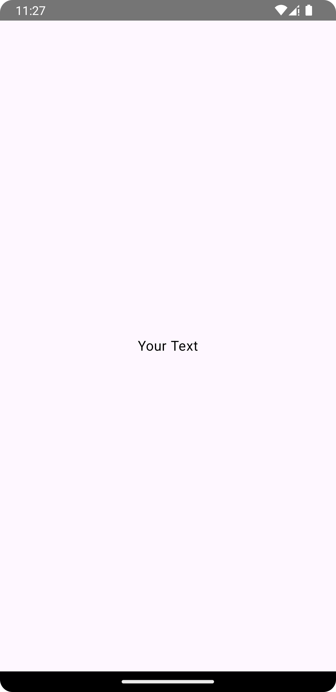
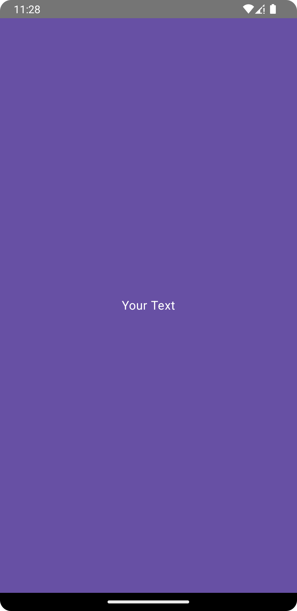
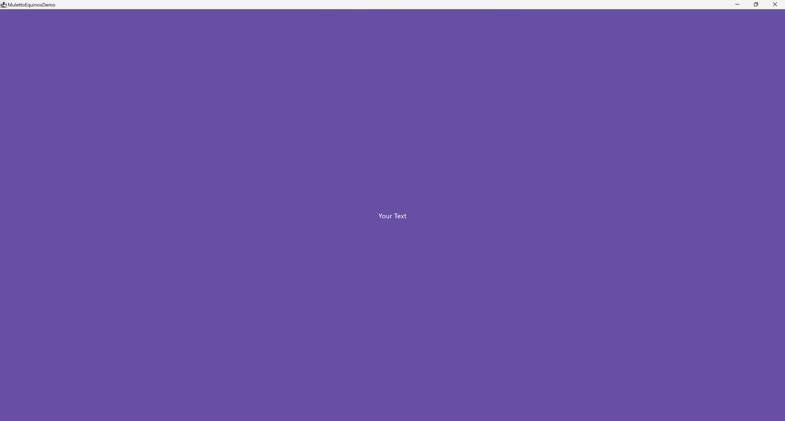
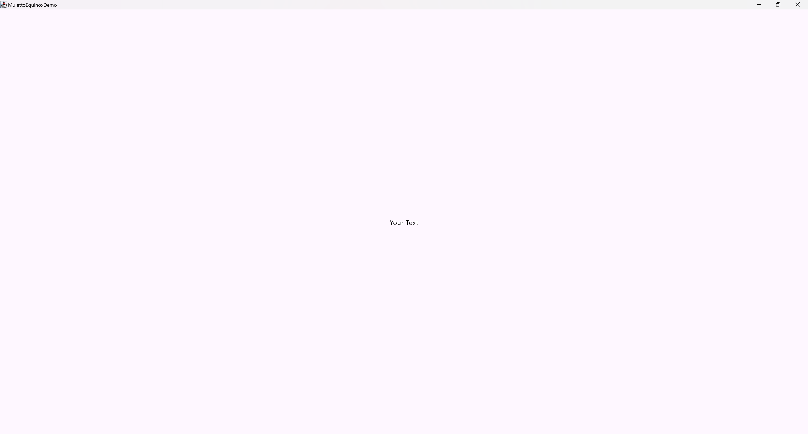

# ChameleonText

This component allows to change the text color dynamically based on the background of the container where the text is
above

## Usage

```kotlin
class TestScreen : EquinoxScreen<EquinoxViewModel>() {

    @Composable
    override fun ArrangeScreenContent() {

        // dark background example color        
        val backgroundColor = MaterialTheme.colorScheme.primary

        // light background example color
        val backgroundColor = MaterialTheme.colorScheme.surface

        Column(
            modifier = Modifier
                .fillMaxSize()
                .background(backgroundColor),
            horizontalAlignment = Alignment.CenterHorizontally,
            verticalArrangement = Arrangement.Center
        ) {

            // with a painter
            ChameleonText(
                text = "Your Text",
                backgroundPainter = painter // the painter value
            )

            // with an background image
            ChameleonText(
                text = "Your Text",
                backgroundImage = backgroundImage // the image used as background
            )

            // with an hex color formar
            ChameleonText(
                text = "Your Text",
                hexBackgroundColor = hexBackground // the hex color used as background
            )

            // with a color value
            ChameleonText(
                text = "Your Text",
                backgroundColor = backgroundColor
            )
        }
    }

}
```

## Customization

Check out the table below to apply your customizations to the component:

| Property         | Description                                                                                                                                                                                                                                            |
|------------------|--------------------------------------------------------------------------------------------------------------------------------------------------------------------------------------------------------------------------------------------------------|
| `modifier`       | The `Modifier` to be applied to this layout node                                                                                                                                                                                                       |
| `fontSize`       | The size of glyphs to use when painting the text. See `TextStyle.fontSize`                                                                                                                                                                             |
| `fontStyle`      | The typeface variant to use when drawing the letters (e.g., italic). See `TextStyle.fontStyle`                                                                                                                                                         |
| `fontWeight`     | The typeface thickness to use when painting the text (e.g., `FontWeight.Bold`)                                                                                                                                                                         |
| `fontFamily`     | The font family to be used when rendering the text. See `TextStyle.fontFamily`                                                                                                                                                                         |
| `letterSpacing`  | The amount of space to add between each letter. See `TextStyle.letterSpacing`                                                                                                                                                                          |
| `textDecoration` | The decorations to paint on the text (e.g., an underline). See `TextStyle.textDecoration`                                                                                                                                                              |
| `textAlign`      | The alignment of the text within the lines of the paragraph. See `TextStyle.textAlign`                                                                                                                                                                 |
| `lineHeight`     | Line height for the `Paragraph` in `TextUnit` unit, e.g. SP or EM. See `TextStyle.lineHeight`                                                                                                                                                          |
| `overflow`       | How visual overflow should be handled                                                                                                                                                                                                                  |
| `softWrap`       | Whether the text should break at soft line breaks. If false, the glyphs in the text will be positioned as if there was unlimited horizontal space. If `softWrap` is false, `overflow` and `TextAlign` may have unexpected effects                      |
| `maxLines`       | An optional maximum number of lines for the text to span, wrapping if necessary. If the text exceeds the given number of lines, it will be truncated according to `overflow` and `softWrap`. It is required that `1 <= minLines <= maxLines`           |
| `minLines`       | The minimum height in terms of minimum number of visible lines. It is required that `1 <= minLines <= maxLines`                                                                                                                                        |
| `onTextLayout`   | Callback that is executed when a new text layout is calculated. A `TextLayoutResult` object provides paragraph information, size of the text, baselines and other details. Can be used to add decorations or functionality, e.g., selection highlights |
| `style`          | Style configuration for the text such as color, font, line height, etc.                                                                                                                                                                                |

## Appearance

The screenshots are taken using the `backgroundColor` param component, but the results are the same using others
`ChameleonText` components

### Mobile

| Dark background                                                                                                               | Light background                                                                                                            |
|-------------------------------------------------------------------------------------------------------------------------------|-----------------------------------------------------------------------------------------------------------------------------|
| { .shadow .mobile-appearance } | { .shadow .mobile-appearance } |

### Desktop & Web

#### Dark background

{ .shadow }

#### Light background

{ .shadow }