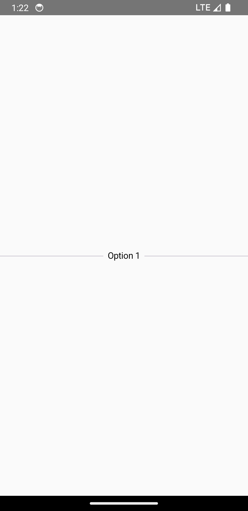
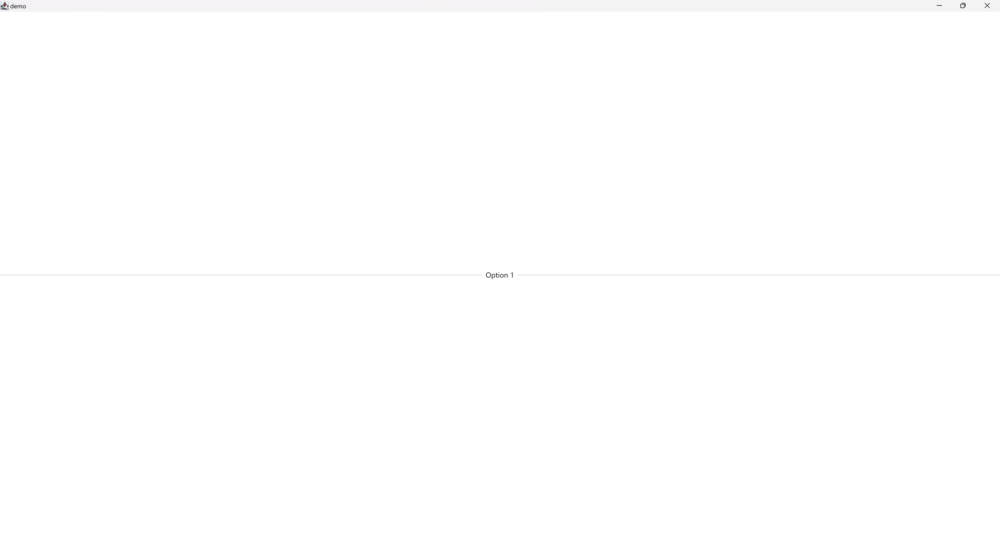

This component allows to divide sections with a representative text

## Usage

```kotlin
class TestScreen : EquinoxScreen<EquinoxViewModel>() {

    @Composable
    override fun ArrangeScreenContent() {
        Column(
            modifier = Modifier
                .fillMaxSize(),
            horizontalAlignment = Alignment.CenterHorizontally,
            verticalArrangement = Arrangement.Center
        ) {
            // create the components with the default settings
            TextDivider(
                text = "Option 1" // your text
            )
        }
    }

}
```

## Customization

Check out the table below to apply your customizations to the component:

| Parameter           | Description                                                                                                          |
|---------------------|----------------------------------------------------------------------------------------------------------------------|
| `containerModifier` | The `Modifier` to apply to the container row                                                                         |
| `textModifier`      | The `Modifier` to apply to the text composable                                                                       |
| `fillMaxWidth`      | Whether the composable must occupy the entire horizontal space                                                       |
| `thickness`         | Thickness of this divider line. Using `Dp.Hairline` will produce a single pixel divider regardless of screen density |
| `dividerColor`      | The color of this divider line                                                                                       |
| `textStyle`         | The style to apply to the `text`                                                                                     |

## Appearance

### Mobile

{ .shadow .mobile-appearance }

### Desktop & Web

{ .shadow }