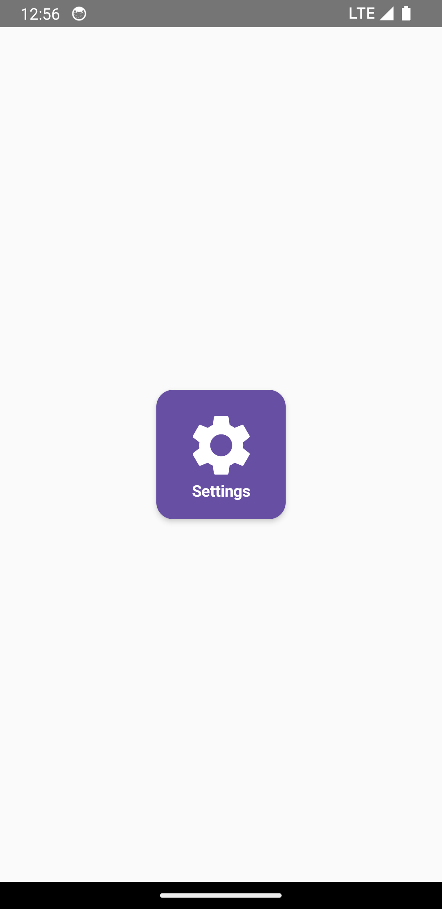
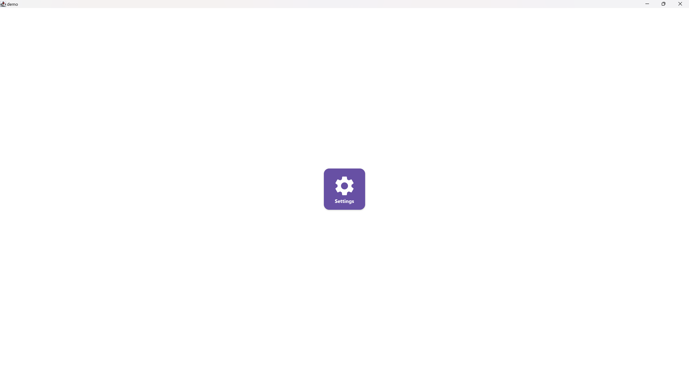
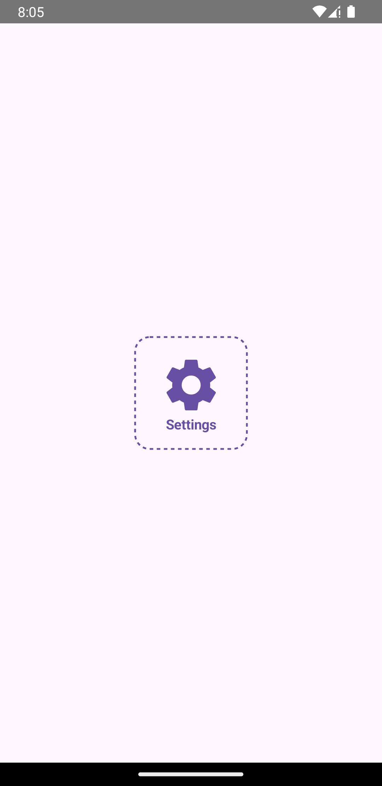
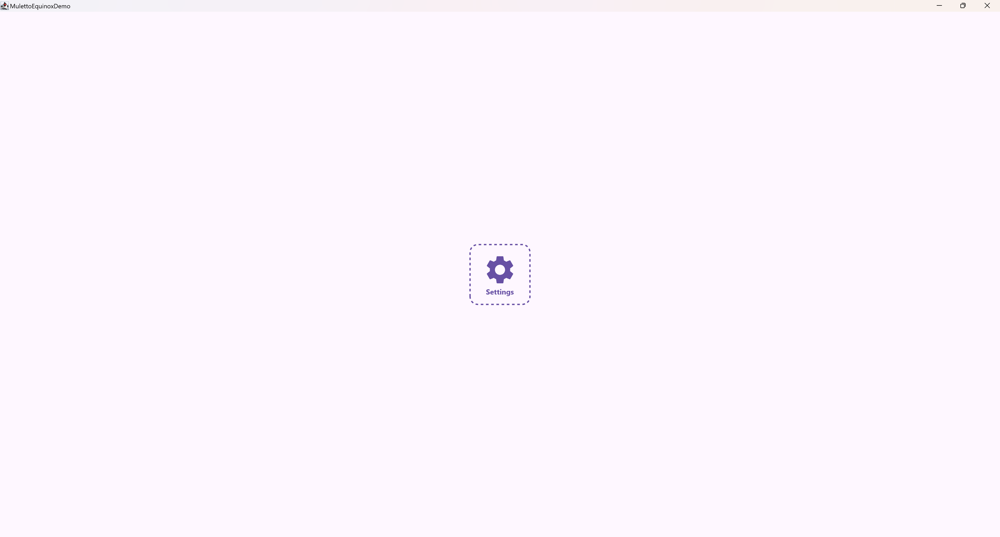

This component allows users to quickly understand options and interact with them and can group related actions or
information

## Classic Tile

### Usage

```kotlin
class TestScreen : EquinoxScreen<EquinoxViewModel>() {

    @Composable
    override fun ArrangeScreenContent() {
        Column(
            modifier = Modifier
                .fillMaxSize(),
            horizontalAlignment = Alignment.CenterHorizontally,
            verticalArrangement = Arrangement.Center
        ) {
            Tile(
                icon = Icons.Default.Settings, // representative icon
                text = "Settings", // representative text
                contentColor = Color.White, // customize the content color
                onClick = {
                    // your action
                }
            )
        }
    }

}
```

### Customization

Check out the table below to apply your customizations to the component:

| Parameter        | Description                                   |
|------------------|-----------------------------------------------|
| `modifier`       | The modifier to apply to the container `Card` |
| `size`           | The size of the tile                          |
| `shape`          | The shape of the tile                         |
| `containerColor` | The color scheme to apply to the tile         |
| `contentColor`   | The color of the content, icon, and the text  |
| `elevation`      | The elevation of the tile                     |
| `iconSize`       | The size of the `icon`                        |
| `fontWeight`     | The weight to apply to the `text`             |
| `textStyle`      | The style to apply to the `text`              |

### Appearance

#### Mobile

{ .shadow .mobile-appearance }

#### Desktop & Web

{ .shadow }

## Dashed Tile

### Usage

```kotlin
class TestScreen : EquinoxScreen<EquinoxViewModel>() {

    @Composable
    override fun ArrangeScreenContent() {
        Column(
            modifier = Modifier
                .fillMaxSize(),
            horizontalAlignment = Alignment.CenterHorizontally,
            verticalArrangement = Arrangement.Center
        ) {
            DashedTile(
                icon = Icons.Default.Settings, // representative icon
                text = "Settings", // representative text
                onClick = {
                    // your action
                }
            )
        }
    }

}
```

### Customization

Check out the table below to apply your customizations to the component:

| Parameter        | Description                                           |
|------------------|-------------------------------------------------------|
| `modifier`       | The modifier to apply to the container `Card`         |
| `strokeWidth`    | The stroke width to apply as dashed effect            |
| `intervals`      | The number of the interval from each part of the line |
| `phase`          | The pixel offset for the intervals                    |
| `size`           | The size of the tile                                  |
| `cornerRadius`   | The radius of the tile                                |
| `containerColor` | The color scheme to apply to the tile                 |
| `contentColor`   | The color of the content, icon, and the text          |
| `iconSize`       | The size of the `icon`                                |
| `fontWeight`     | The weight to apply to the `text`                     |
| `textStyle`      | The style to apply to the `text`                      |

### Appearance

#### Mobile

{ .shadow .mobile-appearance }

#### Desktop & Web

{ .shadow }